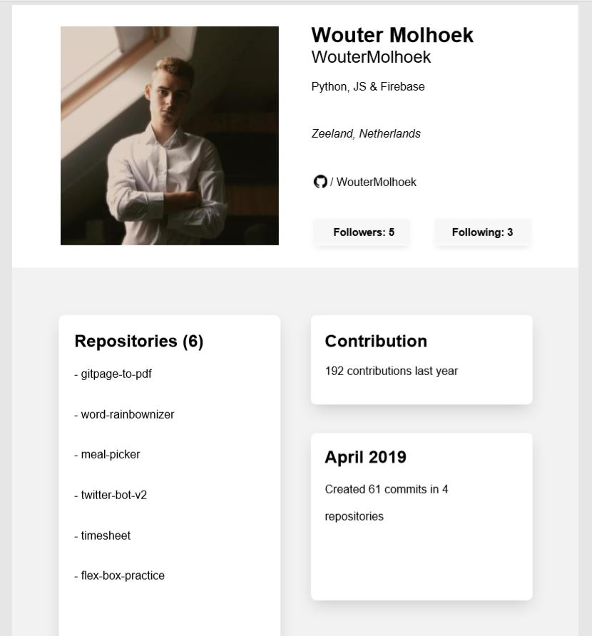

# Github profile to PDF
Transfer your github profile into a pdf that contains information about your repositories and your contribution activity.

## Product

## Built with

* [FPDF](https://pyfpdf.readthedocs.io/en/latest/) - Library for PDF document generation under Python
* [BeautifulSoup](https://www.crummy.com/software/BeautifulSoup/bs4/doc/) - Library for pulling data out of HTML and XML files.
